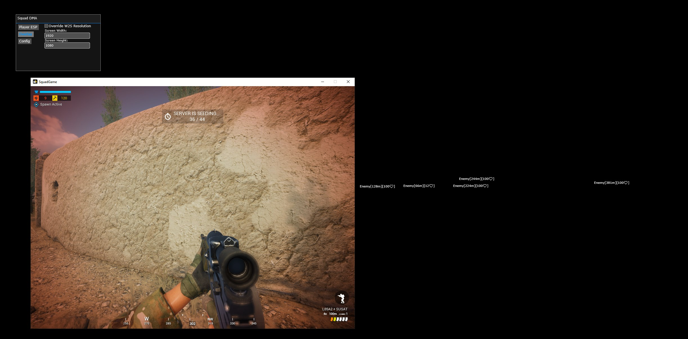
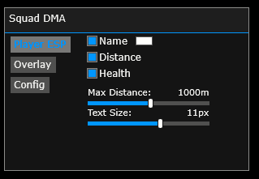

# Squad DMA
Player ESP For Squad

## Showcase

<a href="https://youtu.be/tgMuXgZvYRg">

  

</a>

  

## Instructions
* [Installation Guide](./Instructions.md)
 

## Features
* Player ESP
  * Name
  * Distance
  * Health
  * Font Size
  * Max Distance
* Overlay
  * Custom W2S Resolution
* Config
  * Load
  * Save

## Credits
* [PCILeech](https://github.com/ufrisk/pcileech)
* [MemProcFS](https://github.com/ufrisk/MemProcFS)
* [DMALibrary](https://github.com/Metick/DMALibrary/tree/Master)
